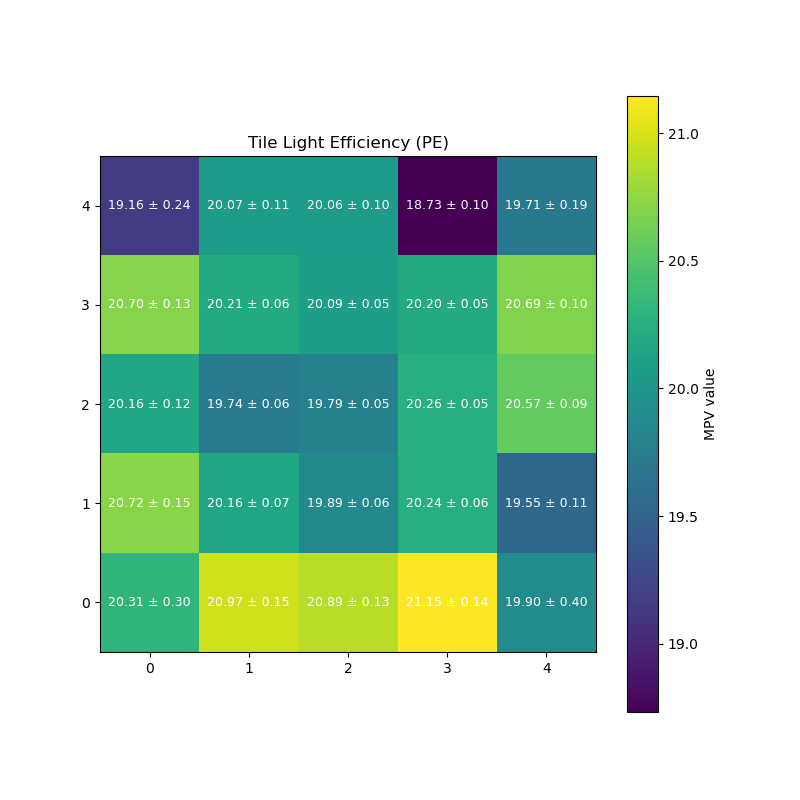

# Testing the SiPM-on-tile Design for Uniformity Using an Sr90 Radioactive Source

This code serves as the basis for using the two-dimensional Velmex translational stage setup currently in use at Wright Lab at Yale University. It moves in the XY directions and has the ability to carry two SiPM-on-tiles where the top is the measured tile and the bottom is used as a trigger with MAJ64 logic as configured in Janus. This code creates a GUI that controls this stage and enables all functions needed to ensure a light yield study can be performed. 

## Overview 
The Longitudinally Segemented Forward Hadronic Calorimeter (LFHCal) subdetector to be used in the Electron-Proton-Ion Collider (ePIC) detector in the Electron-Ion Collider (EIC) is made up of hundreds of thousands of scintillating tiles. Since there is such a large number of these tiles that rely on reading out individual photons, light uniformity across the tile is an important aspect. To test this, a setup of a 2D translational stage with a radioactive Sr90 source held in a bucket above the stage was constructed. This stage allows the top, measured tile to be moved around while a second tile underneath acts as a coincidence trigger. This code creates the GUI to use the stage, enables immediate or post-graphing, and fits each section of the tile to a landau-gauss convolution to determine the MPV value of the distribution. 

## Features 

- Creates a GUI for control of a 2D Velmex Translational Stage
- Includes components for manual stage control, preset locations, calibration, graphing, and an Sr90 scan.
- Includes a manual kill switch for automatic stopping in emergencies
- Creates a separate window for the Sr90 scan
- Allows for analysis and graphing immediately after the run

## Dependencies

This code requires:

- Python 3.9 or higher
- Standard Library:
  - tkinter
  - subprocess
  - sys
  - time
  - pathlib
  - threading
  - datetime
  - re
  - os
  - matplotlib
 
- Third-Pary Packages:
  - ROOT
  - numpy
  - serial
  - matplotlib
 
- Project Modules (included in GitHub)
  - LandauGauss.C
  - GraphingLightYield.py
 
- Other requirements:
  - Serial-connected motor controller 
  - External JanusC executable (from Janus GUI)
  - Software is primarily designed for use in Linux systems
  - The setup as laid out in Wright Lab (Sr90 source)
 
## Building and Executing 

To run the code, first navigate to the project directory then perform:
```bash
python3 MotorControlGuiSr90.py
```
Note that sudo will most likely be needed later to open and run Janus.

## Other Notes

Please note that the GUI is setup based on our current design and is liable to changes based on file paths and directories. Please alter the code accordingly. Also note that for troubleshooting, the section where Janus=True can be changed to False to not allow Janus to open and just have the stage move along its path. 

## Example Light Yield Graph

